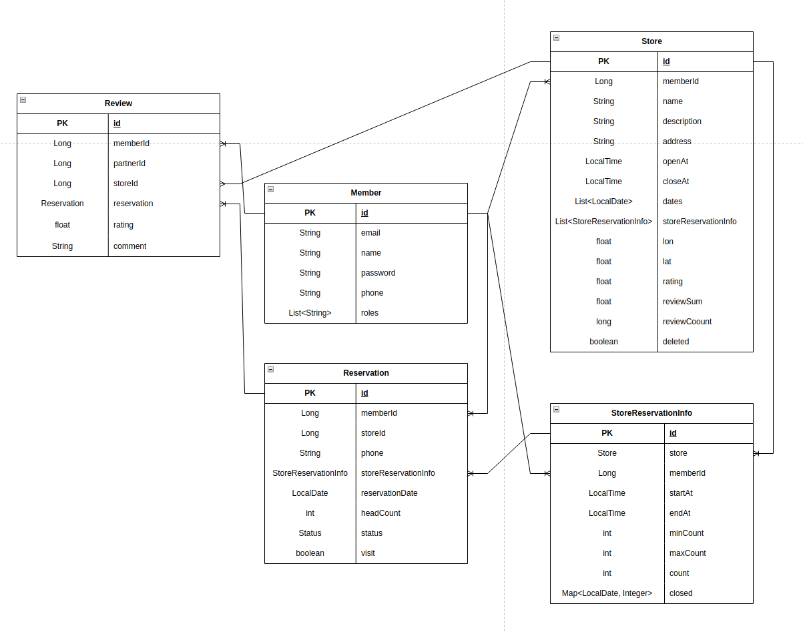

# 매장 테이블 예약 서비스
## 매장을 방문할때 미리 방문 예약을 진행하는 서비스 구현 

## 개발 환경
- Ubuntu
- Java 11
- Intellij
- Spring Boot
- Gradle
- MySQL
- Docker

## 주요 기능
- 고객/파트너 회원가입 
- JWT 이용한 기본 권한 및 인증 
- 매장 정보 등록, 확인, 수정, 삭제
- 매장 검색(가나다순, 별점순, 거리순), 상세정보 확인
- 거리는 카카오API를 이용해 얻어온 위도, 경도를 이용해 계산 
- 예약 등록, 확인, 삭제
- 예약 수락/거절 기능
- 예약 10분전에 도착해 예약 시간까지 방문 확인 기능
- 리뷰 작성, 확인, 수정, 삭제

## 서비스 흐름도

## Erd

## MSA
- Spring Cloud Eureka Server로 마이크로서비스 애플리케이션(MSA) 구현
- Docker 이용

## API
### User API
1. 회원가입  POST /api/member/singup
- 이메일 중복 불가능
- roles 이용해 고객과 파트너 구분
- 비밀번호 암호화 해서 db에 저장
- 파라미터 : 이메일, 이름, 비밀번호, 핸드폰번호, role
- 성공 : 이메일, 이름, 핸드폰번호, role
- 실패 

|Case|HttpStatus|Error Code|Description|
|------|-------|----------|---------|
|이미 등록된 이메일인 경우| BAD_REQUEST | "이미 가입된 회원입니다." | ALREADY_REGISTERED_USER|	
2. 로그인  POST /api/member/singin
- Jwt token 리턴
- 파라미터 : 이메일, 비밀번호
- 성공 : token
- 실패 

|Case|HttpStatus|Error Code|Description|
|------|-------|----------|---------|
|이메일로 가입된 정보가 없는 경우| BAD_REQUEST |  NOT_FOUND_USER |"일치하는 회원이 없습니다."|
|이메일과 패스워드가 일치하지 않는 경우| BAD_REQUEST | LOGIN_CHECK_FAIL |"이메일과 패스워드를 확인해주세요." |	
3. 고객 정보 : GET - /api/member/id
- 토큰을 파싱해 해당 토큰 발급받은 유저 찾기
- 파라미터 : 토큰
- 결과
- 성공 : user id    
### Store API
1. 매장정보 등록 POST - /api/store
- 주소정보 기입하면 카카오 api이용해 위도, 경도 변환해 저장
- 헤더 : token
- 파라미터 : 매장명, 상세정보, 주소, 오픈시간, 마감시간
- 결과
- 성공 : 파트너id, 매장명, 상세정보, 주소, 오픈시간, 마감시간, 위도, 경도, 별점, 삭제여부
- 실패

|Case|HttpStatus|Error Code|Description|
|------------|-------|----------|---------|
|매장명 중복인 경우| BAD_REQUEST |  DUPLICATE_STORE_NAME |"매장명은 중복일 수 없습니다."|
|매장 마감시간이 오픈시간보다 빠른 경우| BAD_REQUEST |  CHECK_RESERVATION_TIME |"[매장 오픈시간 : , 마감시간 : ] 를 확인해주세요."|
2. 매장 예약 상세정보 등록 - /api/store/reservation/info
- 헤더 : token
- 파라미터 : 예약정보리스트(매장id, 예약가능시작시간, 예약가능마감시간, 최소인원, 최대인원)
- 결과
- 성공 : 파트너id, 매장명, 상세정보, 주소, 오픈시간, 마감시간, 위도, 경도, 별점, 삭제여부, 예약정보리스트
- 실패

|Case|HttpStatus|Error Code|Description|
|------------|-------|----------|---------|
|요청 유저 정보와 매장정보가 일치하지 않는 경우| BAD_REQUEST |  UNMATCHED_PARTNER_STORE |"매장 정보와 파트너 정보가 일치하지 않습니다."|
|마감시간이 시작시간보다 빠른 경우| BAD_REQUEST |  CHECK_RESERVATION_TIME |"[예약 시작시간 : , 마감시간 : ] 를 확인해주세요."|
|시작시간이 이전 타임 마감시간보다 빠른 경우| BAD_REQUEST |  CHECK_RESERVATION_TIME |"[예약정보 이전타임 마감시간 : , 다음타임 시작시간: ] 를 확인해주세요."|
3. 매장정보 수정 PUT - /api/store
- 헤더 : token
- 파라미터 : 매장id, 매장명, 상세정보, 주소, 오픈시간, 마감시간
- 결과
- 성공 : 매장id, 매장명, 상세정보, 주소, 오픈시간, 마감시간, 예약정보리스트(매장id, 예약가능시작시간, 예약가능마감시간, 최소인원, 최대인원)
- 실패

|Case|HttpStatus|Error Code|Description|
|------------|-------|----------|---------|
|매장명 중복인 경우| BAD_REQUEST |  DUPLICATE_STORE_NAME |"매장명은 중복일 수 없습니다."|
|요청 유저 정보와 매장정보가 일치하지 않는 경우| BAD_REQUEST |  UNMATCHED_PARTNER_STORE |"매장 정보와 파트너 정보가 일치하지 않습니다."|
|매장 마감시간이 오픈시간보다 빠른 경우| BAD_REQUEST |  CHECK_RESERVATION_TIME |"[매장 오픈시간 : , 마감시간 : ] 를 확인해주세요."|
|마감시간이 시작시간보다 빠른 경우| BAD_REQUEST |  CHECK_RESERVATION_TIME |"[예약 시작시간 : , 마감시간 : ] 를 확인해주세요."|
|시작시간이 이전 타임 마감시간보다 빠른 경우| BAD_REQUEST |  CHECK_RESERVATION_TIME |"[예약정보 이전타임 마감시간 : , 다음타임 시작시간: ] 를 확인해주세요."|
4. 매장 예약 상세정보 수정 - PUT /api/store/reservation/info
- 헤더 : token
- 파라미터 : 예약정보리스트(매장id, 예약가능시작시간, 예약가능마감시간, 최소인원, 최대인원)
- 결과
- 성공 : 파트너id, 매장명, 상세정보, 주소, 오픈시간, 마감시간, 위도, 경도, 별점, 삭제여부, 예약정보리스트
- 실패

|Case|HttpStatus|Error Code|Description|
|------------|-------|----------|---------|
|요청 유저 정보와 매장정보가 일치하지 않는 경우| BAD_REQUEST |  UNMATCHED_PARTNER_STORE |"매장 정보와 파트너 정보가 일치하지 않습니다."|
|매장 예약 상세정보에 해당하는 예약있는 경우| BAD_REQUEST |  STILL_HAVE_RESERVATION |"해당 매장에 예약이 남아 있습니다."|
|마감시간이 시작시간보다 빠른 경우| BAD_REQUEST |  CHECK_RESERVATION_TIME |"[예약 시작시간 : , 마감시간 : ] 를 확인해주세요."|
|시작시간이 이전 타임 마감시간보다 빠른 경우| BAD_REQUEST |  CHECK_RESERVATION_TIME |"[예약정보 이전타임 마감시간 : , 다음타임 시작시간: ] 를 확인해주세요."|
5. 예약 가능 날짜 수정 - PATCH /api/store/reservation/date
- 헤더 : token
- 파라미터 : 매장id, 예약가능날짜리스트 
- 결과
- 성공 : 매장 정보
- 실패

|Case|HttpStatus|Error Code|Description|
|------------|-------|----------|---------|
|요청 유저 정보와 매장정보가 일치하지 않는 경우| BAD_REQUEST |  UNMATCHED_PARTNER_STORE |"매장 정보와 파트너 정보가 일치하지 않습니다."|
6. 예약 마감 여부 수정 - PATCH /api/store/reservation/date/closed
- 헤더 : token
- 파라미터 : 매장id, 해당날짜, 예약가능여부(-1: 예약 마감, int: 예약가능 인원)
- 결과
- 성공 : 매장 정보
- 실패

|Case|HttpStatus|Error Code|Description|
|------------|-------|----------|---------|
|요청 유저 정보와 매장 예약 상세정보가 일치하지 않는 경우| BAD_REQUEST |  NOT_FOUND_RESERVATION_INFO |"매장 예약 상세정보가 존재하지 않습니다."|
|예약 가능한 날짜가아닌데 수정하려고 시도하는 경우| BAD_REQUEST |  CANNOT_UPDATE_INFO |"예약이 열려있지 않은 날짜입니다."|
7. 매장정보 삭제 PATCH - /api/store
- 헤더 : token
- 파라미터 : 매장id
- 결과
- 성공 : 매장 정보
- 실패

|Case|HttpStatus|Error Code|Description|
|------------|-------|----------|---------|
|요청 유저 정보와 매장 예약 상세정보가 일치하지 않는 경우| BAD_REQUEST |  NOT_FOUND_RESERVATION_INFO |"매장 예약 상세정보가 존재하지 않습니다."|
|이미 삭제된 매장인 경우| BAD_REQUEST |  ALREADY_DELETED_STORE |"이미 삭제된 매장입니다."|
8. 매장정보 삭제 PATCH - /api/store/reservation/info
- 헤더 : token
- 파라미터 : 매장 예약 상세정보 id 리스트, 매장 id
- 결과
- 성공 : 매장 정보
- 실패

|Case|HttpStatus|Error Code|Description|
|------------|-------|----------|---------|
|요청 유저 정보와 매장 예약 상세정보가 일치하지 않는 경우| BAD_REQUEST |  NOT_FOUND_RESERVATION_INFO |"매장 예약 상세정보가 존재하지 않습니다."|
|매장 예약 상세정보에 해당하는 예약있는 경우| BAD_REQUEST | STILL_HAVE_RESERVATION |"해당 매장에 예약이 남아 있습니다."|
9. 매장예약 상세정보 리턴 GET - /api/store/info/{id}
- 파라미터 : 매장 예약 상세정보 id
- 결과
- 성공 : 매장 예약 상세 정보 
- 실패

|Case|HttpStatus|Error Code|Description|
|------------|-------|----------|---------|
|매장정보 없는 경우| BAD_REQUEST | NOT_FOUND_STORE |"매장명이 존재하지 않습니다."|
10. 매장 정보 리턴 GET - /api/store/{id}
- 파라미터 : 매장 id
- 결과
- 성공 : 매장 정보 
- 실패

|Case|HttpStatus|Error Code|Description|
|------------|-------|----------|---------|
|매장정보 없는 경우| BAD_REQUEST | NOT_FOUND_RESERVATION_INFO |"매장 예약 상세정보가 존재하지 않습니다."|
11. 파트너의 매장 정보 리턴 GET - /api/store/{id}/{partnerId}
- 파라미터 : 매장 id
- 결과
- 성공 : 매장 정보 
- 실패

|Case|HttpStatus|Error Code|Description|
|------------|-------|----------|---------|
|매장정보 없는 경우| BAD_REQUEST | UNMATCHED_PARTNER_STORE |"매장 정보와 파트너 정보가 일치하지 않습니다."|
12. 예약 가능한 날짜인지 확인 POST - /api/store/date/check
- 파라미터 : reservationDate(예약 원하는 날짜), storeId
- 결과
- 성공 : boolean
13. 해당 날짜의 예약 가능 잔여인원 감소 POST - /api/store/decrease
- 파라미터 : storeReservationInfoId, reservationDate(예약 원하는 날짜), count
- 결과
- 성공 : ok
- 실패

|Case|HttpStatus|Error Code|Description|
|------------|-------|----------|---------|
|매장정보 없는 경우| BAD_REQUEST | NOT_FOUND_RESERVATION_INFO |"매장 예약 상세정보가 존재하지 않습니다."|
14. 해당 날짜의 예약 가능 잔여인원 증가 POST - /api/store/increase
- 파라미터 : storeReservationInfoId, reservationDate(예약 원하는 날짜), count
- 결과
- 성공 : ok
- 실패

|Case|HttpStatus|Error Code|Description|
|------------|-------|----------|---------|
|매장정보 없는 경우| BAD_REQUEST | NOT_FOUND_RESERVATION_INFO |"매장 예약 상세정보가 존재하지 않습니다."|
15. 후기 추가 or 수정시 매장의 별점 변경 POST - /api/store/rating
- 파라미터 : storeId, rating
- 결과
- 성공 : ok
- 실패

|Case|HttpStatus|Error Code|Description|
|------------|-------|----------|---------|
|매장정보 없는 경우| BAD_REQUEST | NOT_FOUND_STORE |"매장명이 존재하지 않습니다."|
16. 후기 삭제시 매장의 별점 감소 POST - /api/store/rating
- 파라미터 : storeId, rating
- 결과
- 성공 : ok
- 실패

|Case|HttpStatus|Error Code|Description|
|------------|-------|----------|---------|
|매장정보 없는 경우| BAD_REQUEST | NOT_FOUND_STORE |"매장명이 존재하지 않습니다."|

17. 매장 리스트 - 이름으로 찾기 GET - /api/store/search?keyword=
- 헤더 : token
- 대문자, 소문자 상광없이 키워드를 포함하고 삭제되지 않은 매장들 반환 
- 파라미터 : 키워드, Pageable
- 결과
- 성공 : 매장정보 리스트
18. 매장 리스트 - 가나다순 GET - /api/store/search/alphabet
- 헤더 : token
- 삭제되지않은 매장들을 name 으로 오름차순 정렬해 반환 
- 파라미터 : Pageable
- 결과
- 성공 : 매장정보 리스트
19. 매장 리스트 - 별점순 GET - /api/store/search/rating
- 헤더 : token
- 삭제되지않은 매장들을 rating 으로 내림차순 정렬해 반환
- 파라미터 : Pageable
- 결과
- 성공 : 매장정보 리스트
20. 매장 리스트 - 거리순 : GET - /api/store/search/distance?address=
- 헤더 : token
- 요청한 주소와 가까운 순으로 매장들 반환
- 파라미터 : 현재주소, Pageable
- 결과
- 성공 : 매장정보 리스트
21. 특정 매장의 상세정보 리턴 GET - /api/store/detail
- 파라미터 : storeId
- 결과
- 성공 : 매장 정보
- 실패

|Case|HttpStatus|Error Code|Description|
|------------|-------|----------|---------|
|매장정보 없는 경우| BAD_REQUEST | NOT_FOUND_STORE |"매장명이 존재하지 않습니다."|
### Store API
1. 매장 예약 : POST - /api/reservation/customer
- 헤더 : token
- 파라미터 : 예약상세정보id, 예약인원, 신청핸드폰번호, 예약날짜
- 결과
- 성공 : id, 고객id, 매장id, 신청핸드폰번호, 예약상세정보id, 예약날짜, 예약인원, 상태, 방문여부
- 실패

|Case|HttpStatus|Error Code|Description|
|------------|-------|----------|---------|
|요청 유저 정보와 매장 예약 상세정보가 일치하지 않는 경우| BAD_REQUEST |  NOT_FOUND_RESERVATION_INFO |"매장 예약 상세정보가 존재하지 않습니다."|
|예약이 오픈되지 않은 날짜에 신청한 경우| BAD_REQUEST | CANNOT_RESERVATION_DATE |"예약 가능한 날짜가 아닙니다."|
|삭제된 매장에 신청한 경우| BAD_REQUEST | ALREADY_DELETED_STORE |"이미 삭제된 매장입니다."|
|예약 정보에 같은 날짜로 중복 신청하는 경우| BAD_REQUEST | ALREADY_MAKE_RESERVATION |"예약정보가 존재합니다."|
|예약 인원이 최소인원보다 적은 경우| BAD_REQUEST | LOWER_STORE_MIN_CAPACITY |"예약 가능 인원이 부족합니다."|
|예약 인원이 최대인원보다 많은 경우| BAD_REQUEST | OVER_STORE_MAX_CAPACITY |"예약 가능인원을 초과하였습니다."|
|마감된 정보에 신청한 경우| BAD_REQUEST | RESERVATION_CLOSED |"예약이 마감되었습니다."|
2. 매장 예약 취소 : DELETE - /api/reservation/customer/{id}
- 헤더 : token
- 파라미터 : 예약아이디
- 결과
- 성공 : 예약 정보
- 실패

|Case|HttpStatus|Error Code|Description|
|------------|-------|----------|---------|
|취소하려는 예약이 본인이 신청한 예약이 아닌 경우| BAD_REQUEST |  UNMATCHED_MEMBER_RESERVATION |"예약 정보와 고객 정보가 일치하지 않습니다."|
|예약 상세정보가 존재하지 경우| BAD_REQUEST |  NOT_FOUND_RESERVATION_INFO |"매장 예약 상세정보가 존재하지 않습니다."|
3. 매장 방문 확인 : POST - /api/reservation/customer/visit
- 헤더 : token
- 매장 예약 10분전에 도착해 방문 확인
- 파라미터 : 예약id
- 결과
- 성공 : 예약 정보
- 실패

|Case|HttpStatus|Error Code|Description|
|------------|-------|----------|---------|
|취소하려는 예약이 본인이 신청한 예약이 아닌 경우| BAD_REQUEST |  UNMATCHED_MEMBER_RESERVATION |"예약 정보와 고객 정보가 일치하지 않습니다."|
|예약이 거절당한 경우| BAD_REQUEST |  CHECK_RESERVATION_STATUS |"예약이 거절되었습니다."|
|예약이 확정되지 않은 경우| BAD_REQUEST |  CHECK_RESERVATION_STATUS |"예약이 확인중입니다."|
|예약한 날이 아닌 다른날 방문 확인 하는 경우| BAD_REQUEST |  NOT_TODAY_RESERVATION |"[예약 날짜 : ] 를 확인해주세요."|
|예약시간 10분전보다 일찍 방문확인 하는 경우| BAD_REQUEST |  CANNOT_CHECK_YET |"[예약 시간 :  , 현재 시간 : ] 방문 확인은 10분전부터 가능합니다."|
|예약 시간을 지나 방문 확인하는 경우| BAD_REQUEST |  OVER_RESERVATION_TIME |"[예약 시간 : , 현재 시간 : ] 예약 시간이 지났습니다."|
4. 고객이 자신이 예약한 리스트 확인 : GET - /api/reservation/customer/search
- 헤더 : token
- 파라미터 : pageable
- 결과
- 성공 : 고객의 예약 리스트
5. 고객이 특정 매장에 예약한 리스트 확인 : GET - /api/reservation/customer/search/{storeId}
- 헤더 : token
- 파라미터 : 매장id, pageable
- 결과
- 성공 : 고객의 특정매장 예약 리스트
5. 매장 예약 수락/거절 : PATCH - /api/reservation/partner
- 헤더 : token
- 파라미터 : 예약아이디, 상태(승인/거절)
- 결과
- 성공 : 예약정보
- 실패

|Case|HttpStatus|Error Code|Description|
|------------|-------|----------|---------|
|예약정보가 존재하지 않는 경우| BAD_REQUEST |  NOT_FOUND_RESERVATION |"예약 정보가 존재하지 않습니다."|
|예약 상세정보가 존재하지 경우| BAD_REQUEST |  NOT_FOUND_RESERVATION_INFO |"매장 예약 상세정보가 존재하지 않습니다."|
|요청 유저 정보와 매장 정보가 일치하지 않는 경우| BAD_REQUEST |  UNMATCHED_PARTNER_STORE |"매장 정보와 파트너 정보가 일치하지 않습니다."|
|이미 승인한 예약인 경우| BAD_REQUEST |  ALREADY_CHANGE_STATUS |"이미 승인된 예약입니다."|
|이미 거절한 예약인 경우| BAD_REQUEST |  ALREADY_CHANGE_STATUS |"이미 거절된 예약입니다."|
|신청인원이 예약 가능 잔여인원보다 많은 경우| BAD_REQUEST |  OVER_RESERVATION_COUNT |"예약 가능 인원을 초과합니다."|
6. 파트너가 자신의 특정 매장 예약 리스트 날짜별 확인 : GET - /api/reservation/partner/search/{storeId}
- 헤더 : token
- 파라미터 : 매장id, 날짜, pageable
- 결과
- 성공 : 매장의 예약 리스트
7. 리뷰 등록 : POST -/api/reservation/customer/review
- 헤더 : token
- 파라미터 : 예약id, 고객아이디, 후기, 별점
- 결과
- 성공 : 예약 정보
- 실패

|Case|HttpStatus|Error Code|Description|
|------------|-------|----------|---------|
|리뷰 등록하는 고객정보와 예약 고객정보가 일치하지 않는 경우| BAD_REQUEST |  UNMATCHED_CUSTOMER_RESERVATION |"고객 정보와 예약 정보가 일치하지 않습니다."|
|방문하지 않은 예약에 리뷰를 등록하려고 하는 경우| BAD_REQUEST |  VISIT_NOT_TRUE |"방문 정보가 존재하지 않습니다."|
|5점 보다 높은 별점을 준 경우| BAD_REQUEST |  OVER_RATING_LIMIT |"별점은 최대 5점까지 가능합니다."|
|등록 요청 고객이 해당예약에 이미 리뷰 등록한 경우| BAD_REQUEST |  ALREADY_CREATED_REVIEW |"이미 리뷰를 작성하였습니다."|
|리뷰 등록할 매장이 존재하지 않는 경우| BAD_REQUEST |  NOT_FOUND_STORE |"매장 예약 상세정보가 존재하지 않습니다."|
8. 리뷰 수정 : PATCH - /api/reservation/customer/review
- 헤더 : token
- 리뷰 작성자만 수정가능
- 파라미터 : 예약id, 후기, 별점
- 결과
- 성공 : 후기 정보 
- 실패
- 실패

|Case|HttpStatus|Error Code|Description|
|------------|-------|----------|---------|
|리뷰 등록하는 고객정보와 예약 고객정보가 일치하지 않는 경우| BAD_REQUEST |  UNMATCHED_CUSTOMER_RESERVATION |"고객 정보와 예약 정보가 일치하지 않습니다."| 
|5점 보다 높은 별점을 준 경우| BAD_REQUEST |  OVER_RATING_LIMIT |"별점은 최대 5점까지 가능합니다."|
|리뷰 등록할 매장이 존재하지 않는 경우| BAD_REQUEST |  NOT_FOUND_STORE |"매장 예약 상세정보가 존재하지 않습니다."|
9. 고객이 자신이 등록한 리뷰 삭제 : DELETE - /api/reservation/customer/review
- 헤더 : token
- 리뷰 작성자와 매장 파트너만 삭제가능
- 파라미터 : 리뷰id
- 결과
- 성공 : 리뷰 정보
- 실패

|Case|HttpStatus|Error Code|Description|
|------------|-------|----------|---------|
|리뷰 등록하는 고객정보와 예약 고객정보가 일치하지 않는 경우| BAD_REQUEST |  UNMATCHED_CUSTOMER_RESERVATION |"고객 정보와 예약 정보가 일치하지 않습니다."| 
|리뷰 삭제할 매장이 존재하지 않는 경우| BAD_REQUEST |  NOT_FOUND_STORE |"매장 예약 상세정보가 존
10. 고객이 등록한 모든 리뷰 확인 : GET - /api/reservation/customer/review/search
- 헤더 : token
- 파라미터 : Pageable
- 결과
- 성공 : 리뷰 리스트재하지 않습니다."|
11. 파트너가 자신의 매장에 등록된 리뷰 삭제 : DELETE - /api/reservation/partner/review
- 헤더 : token
- 리뷰 작성자와 매장 파트너만 삭제가능
- 파라미터 : 리뷰id
- 결과
- 성공 : 리뷰 정보
- 실패

|Case|HttpStatus|Error Code|Description|
|------------|-------|----------|---------|
|본인 매장의 리뷰가 아닌 경우| BAD_REQUEST |  UNMATCHED_PARTNER_REVIEW |"리뷰 작성자와 매장 관리자만 삭제가능합니다."| 
|리뷰 삭제할 매장이 존재하지 않는 경우| BAD_REQUEST |  NOT_FOUND_STORE |"매장 예약 상세정보가 존재하지 않습니다."|

12. 파트너의 특정 매장에 등록된 모든 리뷰 확인 : GET - /api/reservation/partner/review
- 헤더 : token
- 파라미터 : Pageable
- 결과
- 성공 : 리뷰 리스트

